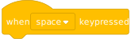
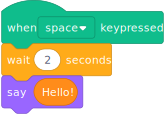
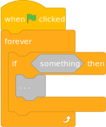
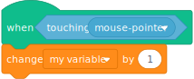
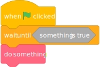
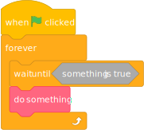
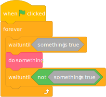
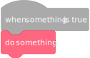

# Events and hats

import {ExtensionCode, Spoiler} from './utils.js';

Event blocks and hat blocks are two types of blocks that allow you to control when a script runs. Even though they look similar, they are different.

## Event blocks

Event blocks are for running scripts in response to an external event. An example of this is "when flag clicked" - the event is when the user clicks on the flag button. "when this sprite clicked" similarly is run in response to a click event, though Scratch does a bit more work to figure out which sprite the event happened on. Event blocks can be used for any external event that lets you run a callback.

:::warning
Event blocks are only supported in unsandboxed extensions.
:::

Event blocks never get executed; they just mark which scripts to run. For example, consider this block you're familiar with:



When you run this block, it doesn't do anything on its own. It just indicates that the things under it should be run. We can create our own event block with similar functionality using `Scratch.BlockType.EVENT`:

<ExtensionCode title="unsandboxed/when-space-key-pressed">{require("!raw-loader!@site/static/example-extensions/unsandboxed/when-space-key-pressed.js")}</ExtensionCode>

We'll talk about what `isEdgeActivated: false` means later, but for event blocks this is **required boilerplate**.

In this example we define the opcode `whenSpacePressed`, but **because it is an event block, we don't write any code for it.**

To start an event block, you use startHats. There are two versions of this:

 - `Scratch.vm.runtime.startHats` which should be used outside of a block  (for example, clicking the green flag)
 - `util.startHats` which should be used when inside of a block (for example, the broadcast block)

:::warning
Using `Scratch.vm.runtime.startHats` instead of `util.startHats` inside of a block can break script execution.
:::

The arguments and return values are the *exact* same. The first argument passed to startHats is the *full* block opcode, which is `extensionid_opcode`. In this example that is `eventexampleunsandboxed_whenSpacePressed`. This will start running all of the scripts in the project whose top block is this opcode.

In this example we used the keydown event, but you can use anything you want. Try using a click event instead, or a setTimeout/setInterval, fetch(), and other APIs. As long as you get a callback, this will work.

## Filtering by menu

You may notice that Scratch's builtin "when key pressed" block has a menu. With our current extension, we would need to add a new block for every key. That's not ideal. Instead, we too can use a menu.

<ExtensionCode title="unsandboxed/when-key-pressed">{require("!raw-loader!@site/static/example-extensions/unsandboxed/when-key-pressed.js")}</ExtensionCode>

The block is defined similar to every other block. Note that event blocks **only support field menus**. You can't have text inputs or anywhere for someone to drop a block. To filter by an argument, it **must be a menu with acceptReporters: false**. (Block types discussed later are more relaxed about this.)

The first argument to startHats is again the full opcode. The second argument to startHats is an object that is used to filter which events to activate. The name of the keys in this object are the names of the block's arguments (`KEY`, in this example) and the values correspond to the menu's values (not text!). You can filter by multiple keys if you want, and all will have to match.

The real "when key pressed" block in Scratch is a bit more complicated than this. This is just an example.

## Filtering by sprite

Scratch's "when this sprite clicked" block only runs on one sprite, not every sprite. To do this yourself, you can use the third (and final) argument of startHats. The third argument can be set to a target object -- every sprite or clone is a "target". If set, only the event blocks in that target will run.

The most common ways to get target objects are:

 - `Scratch.vm.runtime.getTargetForStage()` to get the stage target
 - `Scratch.vm.runtime.getSpriteTargetByName("Sprite1")` to get the non-clone target with a given name
 - `Scratch.vm.runtime.targets` for the full list to search on your own

In this example, we've modified the previous extension to only run the block if they're in the stage.

<ExtensionCode title="unsandboxed/when-key-pressed-stage">{require("!raw-loader!@site/static/example-extensions/unsandboxed/when-key-pressed-stage.js")}</ExtensionCode>

To filter by only sprite and not fields, you can set the second argument to null or an empty object (`{}`).

## Restarting existing threads

Consider this script:



You may observe that if you repeatedly press space, the script doesn't restart (which would reset the wait block timer) -- it just keeps executing. If this isn't what you want, set `shouldRestartExistingThreads: true` on the block.

<ExtensionCode title="unsandboxed/when-key-pressed-restart">{require("!raw-loader!@site/static/example-extensions/unsandboxed/when-key-pressed-restart.js")}</ExtensionCode>

If you recreate the same script, as long as you repeatedly press space, the say block will never execute as the script is restarted each time which resets the wait block timer.

Note that if a script whose top block has `shouldRestartExistingThreads: true` runs calls startHats on itself (similar to "when I receive message1: broadcast message1"), the currently running script will be marked to be restarted but continue to run blocks until it yields.

## Started thread list

Finally, startHats returns an array of the Thread objects that it started. You could use this to monitor thread status, determine how many threads were started, etc.

<ExtensionCode title="unsandboxed/broadcast-5">{require("!raw-loader!@site/static/example-extensions/unsandboxed/broadcast-5.js")}</ExtensionCode>

## Predicate-based hat blocks

:::info
Predicate-based hats are only supported in unsandboxed extensions.
:::

Predicate-based hat blocks let you create something similar to:



A predicate-based hat is basically a more powerful version of event blocks. It uses the same startHats and supports `shouldRestartExistingThreads`. In addition to that, hat block must define a function that returns true or false. All of the block's inputs will be evaluated, and then the hat block can use that information to determine whether or not the blocks under it should run. The block type is `Scratch.BlockType.HAT`. We can approximate the above as something like:

<ExtensionCode title="unsandboxed/when">{require("!raw-loader!@site/static/example-extensions/unsandboxed/when.js")}</ExtensionCode>

You can test the block like this:



Note that this is not quite the same. The forever block will run many, many times per frame if there are no visual changes or if the project is in turbo mode, while the hat block will run exactly once per frame.

`isEdgeActivated: false` is again required boilerplate. The block is defined the same as any other. startHats works the exact same as it does for event blocks: the first argument is the *full* opcode, then optional field filters, then optional target filter.

The important difference is that `when` actually has code. After you do startHats, the block's inputs and arguments will be evaluated and passed to the block. The block can either return `true` to let the script run or `false` to prevent it from running. The block can also return a Promise that resolves to either `true` or `false` if necessary.

One tricky thing here is that Scratch won't automatically start predicate-based hat blocks -- you need to do so yourself. In this example we use the `BEFORE_EXECUTE` event (It runs, as the name implies, before any scripts get run, so anything you start here will be run during that frame). As with event blocks, you can run your predicate-based hat blocks from anywhere that you get a callback.

## Edge-activated hat blocks

Predicate-based hats let you run a script when a condition *is* true. Edge-activated hat blocks let you run a script when a condition *becomes* true.

This is a subtle but important difference. Consider these two scripts:


While the blocks may look similar, they have a significant difference. The top one will only run *once* when the timer *becomes* 5 while the bottom one will run repeatedly after the timer reaches 5.

:::info
Edge-activated hats can be used in any extension, even sandboxed ones
:::

Let's think about how you would implement this using normal Scratch blocks. You could try something like this:



This will only work once. How could we make it work infinitely many times?



Almost. Edge activated hats wait for the condition to become false before the script can run again -- a condition can't *become true* if it is already true.



In essence, edge-activated hats let us rewrite that loop as:



To demonstrate this, we can write an extension similar to Scratch's "when timer greater than" block. The blockType is again `Scratch.BlockType.HAT`, but this time with `isEdgeActivated: true`:

<ExtensionCode title="timer-reimplementation">{require("!raw-loader!@site/static/example-extensions/timer-reimplementation.js")}</ExtensionCode>

Notice that we don't have to run startHats -- Scratch automatically runs startHats for each edge activated hat at the beginning of a frame. This lets you use edge activated hats in sandboxed extensions. You also should not use `shouldRestartExistingThreads: true` for edge-activated hats.

To test this use a script like this:


Open up the JavaScript console, press the green flag, then wait a few seconds. You'll see something like this:

```js
...
2.719 false
2.753 false
2.785 false
2.818 false
2.851 false
2.885 false
2.918 false
2.951 false
2.985 false
3.017 true
4.113 true
4.148 true
4.181 true
4.214 true
4.248 true
4.281 true
4.314 true
4.347 true
4.381 true
...
```

The moment the extension's timer reached 3 seconds, the block returned true, and the script began running. The logs stop for 1 second because the script was running. Once the script finished, the hat block started running again. As it is still returning true, the script will not run again as the condition did not *become true*.

Similar to predicate-based hats, edge-activated hats can accept arbitrary inputs and return a Promise if necessary.

## Exercises

1. Create an event-based block that runs once every second, another one every 5th second, and another every 10th second.
1. Combine each of those event blocks into one block with a menu.
1. Create a command block with a text input that will run a normal Scratch broadcast. The built-in "when I receive" block has the full opcode `event_whenbroadcastreceived` and its single argument is called `BROADCAST_OPTION` which is the name of the broadcast.
1. Modify the previous exercise's broadcast block to be a reporter that returns a comma-separated list containing the name of each sprite that a new thread was started in. (Hint: <Spoiler>Each thread object contains a .target property, and each target object has a .getName() method.</Spoiler>)

## Next steps

We've covered a lot of APIs, but [how do we make sure that the changes we make won't break projects?](./compatibility)
