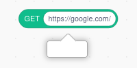

# CORS: Why your fetch block doesn't work

Anyone who's used the Fetch, HTTP, Network and similar extensions has noticed that when you try to fetch certain websites, even after pressing "Allow", the block just doesn't work:

The reason for this is called **CORS**, a security feature that limits how websites can interact.

## What is CORS? {#cors}

It stands for Cross-Origin Resource Sharing, but we're not going to dive into the [internal details](https://developer.mozilla.org/en-US/docs/Glossary/CORS) very much -- other places have already done that. The core problem that CORS solves is simple to understand:

 - Some websites want to **block** access from other websites
 - Other websites want to **allow** access from other websites

Imagine if any website you visited could access your bank's website as though they were you. That would be quite bad! But sometimes this access is not a problem and actually intended. Parts of Scratch's API enable CORS, which is how TurboWarp loads projects from Scratch.

CORS is the way that a website declares whether they want other websites to be able to access theirs. By default, access is not allowed. Websites have to **opt in to CORS** which lets other websites access them. If a website doesn't opt in, your browser will give TurboWarp a very generic "Network error".

## How to fix your blocks {#workarounds}

It depends on what the URL is for.

 - **Switch to a different URL:** If the URL is just being used to host static files, find another host that supports direct downloads and CORS. If one API doesn't support CORS, check if a competitor's API does.
 - **Use a CORS proxy:** Instead of asking your browser to access a website directly, you can ask another server (called a CORS proxy) to access that website on your behalf and then send back the response but allowing CORS. There are many public CORS proxies that you can find online, but they tend to be short lived as they are expensive to operate and heavily abused. CORS proxies can also spy on your project's web requests, as well as tamper with them. This can often be problematic. TurboWarp does not currently run its own CORS proxy.
 - **Switch to TurboWarp Desktop:** The desktop app has an option to bypass CORS. See below.

## Desktop app {#desktop}

In [TurboWarp Desktop](https://desktop.turbowarp.org/), there is an option to bypass CORS to allow access to any website. For security reasons it's disabled by default to match normal web browsers. Open up Desktop Settings under the Settings button in the top left (in older versions Desktop Settings is under the ? button in the top right instead):

import settingsMenu from './assets/desktop-settings.png';

When the desktop settings window opens, check the box by "Allow extensions to access any website".

## Packaged projects {#packaged-projects}

Packaged projects running in a browser are subject to the same limitations as any other website.

Projects that are packaged to Electron apps bypass CORS by default, similar to the option in the desktop app.

## If you are running a server {#servers}

If you want websites to be able to access your website, set the `Access-Control-Allow-Origin` header to `*` in each response you want to be public. If you search the name of the web server or framework you're using followed by "cors", you should find plenty of examples.
