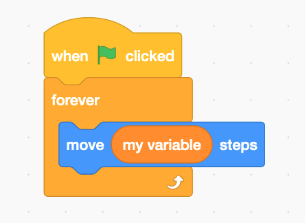

# How TurboWarp runs projects faster

TurboWarp uses a *compiler* to while Scratch uses an *interpreter*. This allows TurboWarp to run up to 20x faster, but it makes live script editing impracticable<sup>[\[1\]](#footnote-1)</sup>.

## An analogy {#analogy}

Consider a complicated math problem, something like long division, a crazy integral, that type of thing.

Scratch's interpreter is like evaluating it entirely by hand, using pencil and paper, without a calculator, using only physical books as reference.

TurboWarp's compiler is like making a computer solve it for you.

In the end, you should end up with the same result, but one of the methods will be a lot faster.

## Technical details {#technical-details}

:::info
The section is simplified to make things easier to understand. The removed things are not that interesting.
:::

Consider the following script:



Scratch's interpreter interprets an [abstract syntax tree](https://en.wikipedia.org/wiki/Abstract_syntax_tree) at runtime. Internally that looks something like this:

```json
{
  "va[U{Cbi_NZpSOSx_kVA": {
    "opcode": "event_whenflagclicked",
    "inputs": {},
    "fields": {},
    "next": "tzXnZ{8G!xK|t^WAWF{m",
    "topLevel": true
  },
  "tzXnZ{8G!xK|t^WAWF{m": {
    "opcode": "control_forever",
    "inputs": {
      "SUBSTACK": {
        "name": "SUBSTACK",
        "block": "$xf$bq|xl(}RhT-K,taS"
      }
    },
    "fields": {},
    "next": null,
    "topLevel": false
  },
  "$xf$bq|xl(}RhT-K,taS": {
    "opcode": "motion_movesteps",
    "inputs": {
      "STEPS": {
        "name": "STEPS",
        "block": "cw__.I:g}Y~`:5KmO00q"
      }
    },
    "fields": {},
    "next": null,
    "topLevel": false
  },
  "cw__.I:g}Y~`:5KmO00q": {
    "opcode": "data_variable",
    "inputs": {},
    "fields": {
      "VARIABLE": {
        "name": "VARIABLE",
        "id": "`jEk@4|i[#Fk?(8x)AV.-my variable"
      }
    },
    "next": null,
    "topLevel": false
  }
}
```


Whenever Scratch executes any block, it has to do a lot of things:

 - It has to look up the block's opcode, to see what code it has to run
 - It has to figure out whether the block has any inputs or fields (similar but different), and evaluate those if it has any. Inputs themselves are blocks that also have to be executed the same as any other, and so are their inputs, and so on.
 - It has to see whether or not there is another block to execute after the current one
 - It has to maintain an internal stack and other state to know what block it's executing at what time
 - It has to constantly check to make sure that no blocks have been modified or deleted since it was last checked

The code that does all this is written in JavaScript. Your browser is already doing a similar variety of tasks whenever it executes any JavaScript code (it's much more complicated, don't worry too much about it), but now the overhead of the interpreter has to be added on top of that.

TurboWarp's compiler removes all of that overhead by converting scripts directly to JavaScript functions, for example, something like this:

```js
const b0 = stage.variables["`jEk@4|i[#Fk?(8x)AV.-my variable"];
return function* () {
  while (true) {
    runtime.ext_scratch3_motion._moveSteps((+b0.value || 0), target);
    if (thread.warp === 0 || isStuck()) yield;
  }
};
```

Things to notice:

 - No more looking up opcodes by hand: all the logic is just in the JavaScript
 - No more looking up inputs or fields by hand: they're just JavaScript arguments
 - No more manual state maintaining: your browser is very good at executing simple JavaScript functions and loops on its own
 - As this is a JavaScript function, there is no way to modify its behavior after it's been created<sup>[\[1\]](#footnote-1)</sup>

Of course, this is a very simple example where the interpreter overhead will be virtually meaningless. For the vast majority of projects, the interpreter is more than good enough. It's only when you start executing hundreds of thousands of blocks per frame that the interpreter overhead begins to become problematic.

----

<a name="footnote-1" />
[1] - It's not strictly impossible to edit JavaScript functions in some ways, but it's very difficult to do without hurting performance or adding significant complexity.
