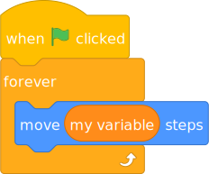

# How TurboWarp runs Scratch projects 10-100x faster

TurboWarp uses a *compiler* while Scratch uses an *interpreter*. This allows TurboWarp to run somewhere between 10-100x faster depending on the project, but it makes live script editing [impracticable](#live-script-editing).

<table style={{textAlign: "center"}}>
    <thead>
        <tr>
            <th>Test</th>
            <th>Scratch</th>
            <th>TurboWarp</th>
        </tr>
    </thead>
    <tbody>
        <tr>
            <td>
                <div><a href="https://scratch.mit.edu/projects/310372816/">Quicksort</a></div>
                <div>Sort 200000 random items</div>
                <div>Lower is better</div>
            </td>
            <td>8.871 seconds</td>
            <td>0.0451 seconds</td>
        </tr>
        <tr>
            <td>
                <div><a href="https://scratch.mit.edu/projects/412737809/">Cycles Raytracer</a></div>
                <div>res=1 samp=10 dof=.08</div>
                <div>Lower is better</div>
            </td>
            <td>814 seconds</td>
            <td>15 seconds</td>
        </tr>
        <tr>
            <td>
                <div><a href="https://scratch.mit.edu/projects/611788242/">Faster SHA-256 Hash</a></div>
                <div>Hashes per second</div>
                <div>Higher is better</div>
            </td>
            <td>146 per second</td>
            <td>3010 per second</td>
        </tr>
    </tbody>
</table>

(Tested using Chromium 140, Arch Linux, i7 4790k)

Consider the following script:



Scratch's interpreter walks an [abstract syntax tree](https://en.wikipedia.org/wiki/Abstract_syntax_tree) at runtime. Internally that looks like this:

```json
{
  "va[U{Cbi_NZpSOSx_kVA": {
    "opcode": "event_whenflagclicked",
    "inputs": {},
    "fields": {},
    "next": "tzXnZ{8G!xK|t^WAWF{m",
    "topLevel": true
  },
  "tzXnZ{8G!xK|t^WAWF{m": {
    "opcode": "control_forever",
    "inputs": {
      "SUBSTACK": {
        "name": "SUBSTACK",
        "block": "$xf$bq|xl(}RhT-K,taS"
      }
    },
    "fields": {},
    "next": null,
    "topLevel": false
  },
  "$xf$bq|xl(}RhT-K,taS": {
    "opcode": "motion_movesteps",
    "inputs": {
      "STEPS": {
        "name": "STEPS",
        "block": "cw__.I:g}Y~`:5KmO00q"
      }
    },
    "fields": {},
    "next": null,
    "topLevel": false
  },
  "cw__.I:g}Y~`:5KmO00q": {
    "opcode": "data_variable",
    "inputs": {},
    "fields": {
      "VARIABLE": {
        "name": "VARIABLE",
        "id": "`jEk@4|i[#Fk?(8x)AV.-my variable"
      }
    },
    "next": null,
    "topLevel": false
  }
}
```

Whenever Scratch executes any block, it has to do a lot of things:

 - It has to look up the block using its ID and which function the block's opcode corresponds to.
 - If the block has inputs, those are also blocks, and must go through the same steps as any other block, and so must any deeper inputs.
 - It manually maintains a stack of blocks, loops, conditions, procedures, etc.
 - Scratch scripts can be yielded, so all of this has to happen in a way that can be paused and resumed later.
 - Scratch scripts can be changed while they're running, so caching everything ahead of time is difficult.
 - etc. There is a *lot* going on in Scratch whenever it executes even a single block.

The interpreter overhead is added on top of the overhead of JavaScript itself. As this code involves many dynamic types, it can be hard for the JavaScript JIT to optimize it.

TurboWarp's compiler removes all of that overhead by converting scripts directly to JavaScript functions. For example, the above script becomes:

```js
const myVariable = stage.variables["`jEk@4|i[#Fk?(8x)AV.-my variable"];
return function* () {
  while (true) {
    runtime.ext_scratch3_motion._moveSteps((+myVariable.value || 0), target);
    yield;
  }
};
```

Things to notice:

 - No more looking up block IDs or opcodes: it's just JavaScript.
 - No more looking up inputs manually: they're just JavaScript arguments.
 - No more manual state maintaining: it's just JavaScript.
 - As this is a single JavaScript function, we can't easily implement [live script editing](#live-script-editing)
 - If the JavaScript JIT notices that a certain variable is always a number, it can theoretically optimize accordingly.
 - This JavaScript looks very strange compared to typical human-written JavaScript and runs slower because we maintain compatibility with edge case Scratch behaviors.
 - We manually formatted the JavaScript and renamed some variables to make it more readable. The real code uses variable names like `b0` and has no formatting.

Of course, this is a very simple script where the interpreter overhead is negligible, which is the case for most projects. It's only when you execute thousands of blocks per frame that the interpreter's overhead becomes significant.

Here's a more complex example: a sorting algorithm - bubble sort.

```js
const length = stage.variables["O;aH~(njYNn}Bl@}!%pS-length-"];
const list = stage.variables["O;aH~(njYNn}Bl@}!%pS-list-list"];
const newLength = stage.variables["O;aH~(njYNn}Bl@}!%pS-new-"];
const i = stage.variables["O;aH~(njYNn}Bl@}!%pS-i-"];
const temp = stage.variables["O;aH~(njYNn}Bl@}!%pS-tmp-"];
return function fun1_sort () {
  length.value = list.value.length;
  // repeat until length = 0
  while (!compareEqual(length.value, 0)) {
    newLength.value = 0;
    i.value = 1;
    // repeat length - 1 times
    for (var counter = ((+length.value || 0) - 1) || 0; counter >= 0.5; counter--) {
      // change i by 1
      i.value = ((+i.value || 0) + 1);
      // if item i - 1 of list is greater than item i of list
      if (
        compareGreaterThan(
          list.value[((((i.value || 0) - 1) || 0) | 0) - 1] ?? "",
          list.value[((i.value || 0) | 0) - 1] ?? ""
        )
      ) {
        // swap item i and i - 1 of list
        temp.value = listGet(list.value, i.value);
        listReplace(
          list,
          i.value,
          list.value[((((+i.value || 0) - 1) || 0) | 0) - 1] ?? ""
        );
        listReplace(
          list,
          (+i.value || 0) - 1,
          temp.value
        );
        newLength.value = i.value;
      }
    }
    length.value = newLength.value;
  }
};
```

Functions such as `listGet`, `listReplace`, and `compareEqual` are part of the TurboWarp runtime and are implemented to match the strange behaviors of Scratch. The functions used by bubble sort are shown below, for your reference. Accuracy and performance are a higher priority than readability for these functions as they tend to be quite hot.

```js
const isNotActuallyZero = val => {
  if (typeof val !== 'string') return false;
  for (let i = 0; i < val.length; i++) {
    const code = val.charCodeAt(i);
    if (code === 48 || code === 9) {
      return false;
    }
  }
  return true;
};

const compareEqualSlow = (v1, v2) => {
  const n1 = +v1;
  if (isNaN(n1) || (n1 === 0 && isNotActuallyZero(v1))) return ('' + v1).toLowerCase() === ('' + v2).toLowerCase();
  const n2 = +v2;
  if (isNaN(n2) || (n2 === 0 && isNotActuallyZero(v2))) return ('' + v1).toLowerCase() === ('' + v2).toLowerCase();
  return n1 === n2;
};

const compareEqual = (v1, v2) => (typeof v1 === 'number' && typeof v2 === 'number' && !isNaN(v1) && !isNaN(v2) || v1 === v2) ? v1 === v2 : compareEqualSlow(v1, v2);

const compareGreaterThanSlow = (v1, v2) => {
  let n1 = +v1;
  let n2 = +v2;
  if (n1 === 0 && isNotActuallyZero(v1)) {
    n1 = NaN;
  } else if (n2 === 0 && isNotActuallyZero(v2)) {
    n2 = NaN;
  }
  if (isNaN(n1) || isNaN(n2)) {
    const s1 = ('' + v1).toLowerCase();
    const s2 = ('' + v2).toLowerCase();
    return s1 > s2;
  }
  return n1 > n2;
};

const compareGreaterThan = (v1, v2) => typeof v1 === 'number' && typeof v2 === 'number' && !isNaN(v1) ? v1 > v2 : compareGreaterThanSlow(v1, v2);

const listIndexSlow = (index, length) => {
  if (index === 'last') {
    return length - 1;
  } else if (index === 'random' || index === 'any') {
    if (length > 0) {
      return (Math.random() * length) | 0;
    }
    return -1;
  }
  index = (+index || 0) | 0;
  if (index < 1 || index > length) {
    return -1;
  }
  return index - 1;
};

const listIndex = (index, length) => {
  if (typeof index !== 'number') {
    return listIndexSlow(index, length);
  }
  index = index | 0;
  return index < 1 || index > length ? -1 : index - 1;
};

const listGet = (list, idx) => {
  const index = listIndex(idx, list.length);
  if (index === -1) {
    return '';
  }
  return list[index];
};

const listReplace = (list, idx, value) => {
  const index = listIndex(idx, list.value.length);
  if (index === -1) {
    return;
  }
  list.value[index] = value;
  list._monitorUpToDate = false;
};
```

### Live script editing {#live-script-editing}

If you start a script using the compiler, you won't be able to move, remove, or add blocks and have the changes be reflected in real time as they would be in Scratch. The script has to be restarted for changes to apply. We believe there are some ways we could make this work, but they will hurt performance or add significant complexity. It's something we want to implement eventually, but not yet.
