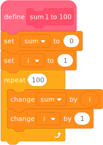

# New Compiler

The compiler is the part of TurboWarp that converts projects to JavaScript. On September 20, 2025, we released a new compiler that is better at analyzing the scripts inside projects to generate even faster JavaScript.

This is the largest single change we've ever made. We've tried to test it thoroughly, but **it's quite likely there are still a few more bugs**. You should report broken projects at [the usual place](https://scratch.mit.edu/users/GarboMuffin/#comments). If your project is broken, you can use https://experiments.turbowarp.org/old-compiler/ instead until we fix the bug in the new compiler.

:::warning
The new compiler breaks a small handful of custom extensions. See the [extensions](#extensions) section below for details and workarounds.
:::

The new compiler is used on the website, the packager, and the desktop app (v1.15.0 and later).

## Performance comparison {#performance}

The performance gain varies a lot depending on the project. Some projects run twice as fast, while others are unchanged, but there should be no projects that run slower.

<table style={{textAlign: "center"}}>
    <thead>
        <tr>
            <th>Test</th>
            <th>Old Compiler</th>
            <th>New Compiler</th>
        </tr>
    </thead>
    <tbody>
        <tr>
            <td>
                <div><a href="https://turbowarp.org/1201938491">Linux in Scratch</a></div>
                <div>Time until shell</div>
                <div>Lower is better</div>
            </td>
            <td>21 seconds</td>
            <td>12 seconds</td>
        </tr>
        <tr>
            <td>
                <div><a href="https://turbowarp.org/611788242">Faster SHA-256 Hash</a></div>
                <div>Hashes per second</div>
                <div>Higher is better</div>
            </td>
            <td>2711 per second</td>
            <td>3010 per second</td>
        </tr>
        <tr>
            <td>
                <div><a href="https://turbowarp.org/310372816">Quicksort</a></div>
                <div>Sort 200000 random items</div>
                <div>Lower is better</div>
            </td>
            <td>0.0515 seconds</td>
            <td>0.0451 seconds</td>
        </tr>
    </tbody>
</table>

(Tested using Chromium 140, Arch Linux, i7 4790k, warp timer disabled)

## Limitations {#limitations}

### Warp timer {#warp-timer}

The [warp timer](warp-timer) forces blocks marked as "run without screen refresh" to briefly pause after running for 500 ms to prevent an infinite loop from causing you to lose unsaved work. This is why the warp timer is automatically enabled when you open the TurboWarp editor.

Unfortunately, the warp timer breaks many of the assumptions that the new compiler uses to optimize projects, so do not expect major performance improvements while you are in the editor or otherwise have the warp timer enabled. They won't run slower than they did in the old compiler, though.

### Extension compatibility {#extensions}

All extensions included in the TurboWarp extension list will work the same, and a vast majority of custom extensions will also continue to work the same.

A small handful of custom extensions use an API called `i_will_not_ask_for_help_when_these_break` to integrate more directly with the compiler. We gave this API that crazy name because we knew it was going to break at some point, and we didn't want a small handful of extensions to restrict us from being able to change the compiler's internals when needed. If your project requires these extensions, you can use https://experiments.turbowarp.org/old-compiler/ instead until extensions become compatible.

If you also need to package your project, you can use https://packager-legacy.turbowarp.org/old-compiler/.

## Brief technical overview {#technical-overview}

The broad idea is that the compiler analyzes scripts to determine what kinds of values each variable may have at each point in the script. This allows it to remove unnecessary type conversions and generate more specialized code. The old compiler tried to do this too, but was unable to reason about loops or conditionals.

Consider this script that sums integers from 1 to 100. Suppose that the block is marked as "run without screen refresh" and warp timer is disabled.



The old compiler generates:

```js
sum.value = 0;
i.value = 1;
for (var a0 = 100; a0 >= 0.5; a0--) {
    sum.value = ((+sum.value || 0) + (+i.value || 0));
    i.value = ((+i.value || 0) + 1);
}
```

`(+something.value || 0)` is how the compiler converts a variable to a number. In this case it is redundant as the variables are already always numbers, but the old compiler did not realize this.

The new compiler instead generates:

```js
sum.value = 0;
i.value = 1;
for (var a0 = 100; a0 > 0; a0--) {
    sum.value = (sum.value + i.value);
    i.value = (i.value + 1);
}
```

No more unnecessary type conversions. The compiler also now realizes that the iteration count is always an integer, so it doesn't need to handle the edge case of decimal iteration counts. Small changes like this can add up to be significant.

If warp timer is enabled or the script is not marked as "run without screen refresh", the new compiler generates the same code as the old compiler. This is because the repeat block might pause before it finishes all iterations, so other scripts have the opportunity to change variables in unknown ways. For example, if another script changed the "i" variable to a string, `i.value + 1` would act like the "join" block instead of addition. The type conversion would be necessary to ensure the script always works correctly in this case.

(We manually cleaned up the JavaScript for this page. The actual code has no formatting and does not have meaningful variable names.)

## Credits {#credits}

[Tacodiva](https://scratch.mit.edu/users/Tacodiva7729/) did almost all the work and persevered through an impossibly long review process.

Early testers helped us find and fix many bugs before release:

 * [Krypto](https://scratch.mit.edu/users/KryptoScratcher/)
 * [Vadik1](https://scratch.mit.edu/users/Vadik1/)
 * [SpinningCube](https://scratch.mit.edu/users/SpinningCube/)
 * [GamingWithDominic](https://scratch.mit.edu/users/GamingWithDominic/)
 * [Scratch_Fakemon](https://scratch.mit.edu/users/Scratch_Fakemon/)
 * [LSPECTRONIZTAR](https://scratch.mit.edu/users/LSPECTRONIZTAR/)
 * [Terminal](https://scratch.mit.edu/users/windowscj/)
