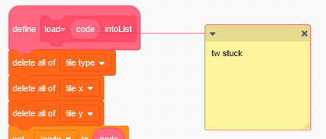

# Script Flags

TurboWarp lets you control how your scripts are compiled through "Script Flags". These are comments attached to the hat block of a script that start with `tw`.

This is what they look like:

 - The comment does not need to be on the first line, but it does need to be on its *own* line. That means pressing enter to push it onto its own line, not just relying on the comment to wrap text around (if unsure, resize the comment a few times and make sure it always stays on its own line)
 - The comment *must* be attached to the hat block of a script, for example "when green flag clicked" or "define procedure". Adding it to the first block in the script or any other block in the script will not work.
 - The comment is case sensitive.

## `tw stuck` {#stuck}

Adding this comment to a script will make it use Warp Timer/Stuck Checking regardless of whether the stuck checking global option is enabled or not.

## `tw nocompile` {#nocompile}

Adding this comment to a script will cause it to not be compiled.

When one procedure used by a script cannot be compiled, the entire script will not be compiled.

This is intended as a debugging tool. **If you use this to workaround a compiler bug, please make sure to report the bug so it can get fixed.**