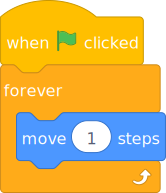

# 60 FPS (Custom FPS)

Custom FPS (frames per second) changes how often scripts are run every second. Most often this is changed to 60 FPS, but any value between 1 and 250 is possible.

A value of 0 is special: It will make the project run at the same framerate as the screen instead of a set interval. This also means that the project's scripts may stop running when the project's tab is hidden.

A vast majority of projects will not work properly with custom framerates. For these projects, [interpolation](interpolation) should be used instead. For example, consider the following simple script:

When running at 30 FPS (as Scratch typically does), this script will run 30 times per second so the sprite will move 30 steps per second. However, if the framerate is changed to 60, the script will run 60 times per second so the sprite will move twice as many steps in a second.

To make projects that are compatible with custom framerates, you should use techniques such as delta time:

 - https://en.wikipedia.org/wiki/Delta_timing
 - https://scratch.org/projects/487694716/ (Scratch example)

These techniques may require significant changes to your project.
