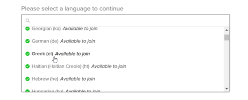

# Help Translate TurboWarp

We're looking for people to help translate TurboWarp into languages other than English. If that interests you, read on.

## Requirements to join as a translator {#requirements}

 - You must be **FLUENT IN THE ENGLISH LANGUAGE**.
 - For example, you’re fluent if you can use TurboWarp in English, or if you understand griffpatch’s videos. If you struggle to understand sentences without a translator, you’re not fluent.
 - You must be a **NATIVE SPEAKER** of the language you want to translate to.
 - You must have an email address, which you should ideally check at least once a week.
 - You must own an account on [scratch.mit.edu](https://scratch.mit.edu/).

If you’re not a native speaker but consider yourself fluent enough, you may also request to join. Keep in mind taking some language classes does not make you fluent. If you wouldn’t change your smartphone’s system language to it, you’re not fluent enough!

We only support languages that Scratch itself supports. Support for RTL languages such as Arabic and Hebrew is currently a work-in-progress. They should mostly work in the editor, but places like the desktop app and packager require additional changes. Efforts to improve this will be prioritized when some more translations are written.

## Steps to join as a translator {#request-to-join}

### 1. Verify your Scratch account

1. Visit [this Scratch studio](https://scratch.mit.edu/studios/33665222/comments) with your Scratch account.
2. Send a studio comment indicating the language you want to translate to (for example, `Greek`).  
    

If you don’t own a Scratch account, please send an email to contact@turbowarp.org instead.

### 2. Create a Transifex account

1. Go to [Transifex open-source Sign up](https://app.transifex.com/signup/open-source/?join_org=turbowarp&join_project=turbowarp).  
1. You will be shown Transifex's "Sign up" screen. **DO NOT sign up with Google.**  
1. In the "business email" field, enter your email (it can be Gmail, Outlook, or any other).
1. In the "username" field, we highly recommend you enter your Scratch username, or a slight variation of it.  
For example, if your Scratch username is `john_walker954`, your Transifex username can be exactly the same (`john_walker954`) or `john_walker954_scratch`.
1. In the "password" field, enter a password.
1. Click the "Sign up" button.
1. You'll be asked for your First name and Last name.  
\- In the **First name**, we recommend you enter your Scratch username.  
\- In the **Last name**, we recommend you enter the language you want to translate to (for example, `Greek`).
1. In the "languages you speak" field, select at least one language you're fluent with (for example, English).
1. Click the "Let's get started" button.
1. Continue with the "requesting a language" steps below.

If you already own a Transifex account and don’t want to create a new one, please send an email to translation@turbowarp.org indicating your Transifex account’s username. Then, continue with the "requesting a language" section below.

### 3. Requesting a language

1. Make sure you’re logged in to Transifex. If you just signed up, you are already logged in.
2. Go to [TurboWarp's Transifex page](https://app.transifex.com/join/?o=turbowarp&p=turbowarp&t=opensource).
3. You’ll be prompted to choose the language you want to translate to.
4. Choose one of the languages which are "available to join". We do not support languages that are not available to join.  
    
5. Click the "Join Project" button.
6. Wait until your request is accepted.

:::tip
If your request is accepted, you’ll receive an email from Transifex. We usually review requests every 48 hours.
:::

:::warning
If your request is denied, you’ll receive an email. If you believe this was a mistake, please send an email to contact@turbowarp.org indicating your Transifex username. See below for other contact methods. 
:::

## Help or contact

If you have any questions about translating, you may choose one of the following options:

 - Send an email to contact@turbowarp.org.
 - [Open a discussion on GitHub](https://github.com/TurboWarp/scratch-gui/discussions) (GitHub account required).
