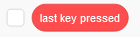
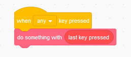

# TurboWarp Blocks

TurboWarp has a section of blocks that allows you to use certain features previously not accessible to Scratch projects.

:::caution
These blocks are **incompatible** with Scratch. Projects that using them **can not** be uploaded to the Scratch website. The only exception to this is "is compiled?", which will work perfectly fine in Scratch (it's not actually a hacked or modded block; you can obtain it using an unmodified Scratch editor)

If you don't use any TurboWarp-exclusive blocks, then there should be no issue with making your project in TurboWarp and uploading it to Scratch. (it will just look like a project made with the offline editor)
:::

## last key pressed {#last-key-pressed}

It tells you the last key that was pressed. It's intended to be used something like this:

## mouse button down? {#mouse-button-down}

It's like "mouse down?" but lets you check each individual button. Keep in mind that due to how Scratch interprets mouse input, it's possible for a block like "is primary mouse button down?" to report true while the standard "mouse down?" reports false.

 * (0) primary is usually left
 * (1) middle is usually scroll wheel
 * (2) secondary is usually right (running this block once will disable right click on the stage)
