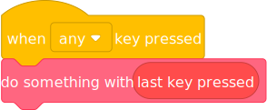

# TurboWarp Blocks

TurboWarp has a section of blocks that allows you to use certain features previously not accessible to Scratch projects.

NEW: TurboWarp now supports unsandboxed extensions which add new blocks! https://extensions.turbowarp.org/

## is compiled? and is TurboWarp? {#is-compiled}

See https://scratch.org/projects/414716080/

These blocks are "compatible" with Scratch because they're actually just modified argument reporters.

:::warning
Every block beyond this warning is **incompatible** with Scratch. Projects that use them **can not** be uploaded to the Scratch website. If you don't use any TurboWarp-exclusive blocks, then there should be no issue with making your project in TurboWarp and uploading it to Scratch.
:::

## last key pressed {#last-key-pressed}

It tells you the last key that was pressed. It's intended to be used something like this:

## mouse button down? {#mouse-button-down}

It's like "mouse down?" but lets you check each individual button. Keep in mind that due to how Scratch interprets mouse input, it's possible for a block like "is primary mouse button down?" to report true while the standard "mouse down?" reports false.

 * (0) primary is usually left
 * (1) middle is usually scroll wheel
 * (2) secondary is usually right (running this block once will disable right click on the stage)
